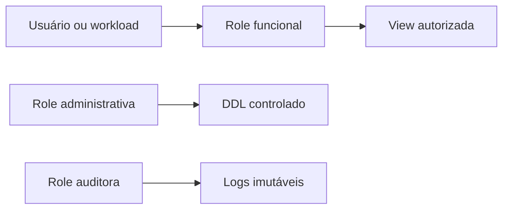

# Menor Privilégio, Separação de Funções e Acesso

Menor privilégio concede apenas as capacidades necessárias, no escopo e tempo necessários. Separação de funções evita que uma identidade concentre criação, aprovação, implantação e auditoria.

## Padrões práticos

- aplicações de leitura não recebem `INSERT`, `UPDATE`, `DELETE` ou DDL;
- pipelines escrevem somente nos schemas e tabelas previstos;
- migrações usam identidade separada do runtime;
- acesso emergencial é temporário, aprovado e auditado;
- produção e desenvolvimento usam credenciais e dados distintos;
- memberships e grants são revisados periodicamente.

Revogar `PUBLIC`, limitar criação de objetos e controlar `search_path` reduz caminhos inesperados. Funções com privilégios do definidor exigem schema qualificado, entrada validada e revisão, pois podem atravessar a fronteira normal de autorização.

> [!note]
> Acesso à rede não substitui autorização no banco. Uma credencial comprometida dentro da rede ainda deve encontrar limites estreitos.
