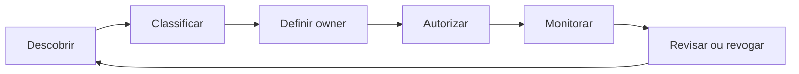

# Auditoria, Lineage, Classificação e Ciclo de Vida

Auditoria responde quem realizou qual ação, quando, de onde, sobre qual objeto e com qual resultado. Ela precisa ser protegida contra alteração, possuir retenção definida e permitir correlação com identidade e solicitação.

Nem toda consulta deve registrar valores completos. Capturar texto com literais pode vazar dados sensíveis e aumentar custo. Prefira evento, objeto, identidade, fingerprint da consulta, decisão de autorização e metadados necessários à investigação.

## Governança como ciclo

Lineage liga origem, transformação e consumidor. Ele permite avaliar impacto antes de mudar uma view e localizar produtos afetados por incidente. Catálogo sem owner e sem processo de atualização torna-se inventário obsoleto.

## Evidências mínimas

- owner técnico e responsável de negócio;
- classificação, finalidade e base de retenção;
- consumidores e dependências;
- grants e memberships aprovados;
- data da última revisão e expiração;
- SLO, qualidade e procedimento de incidente.

> [!tip]
> Automatize detecção de grants excessivos e acessos inativos, mas mantenha decisão e responsabilidade explícitas.
