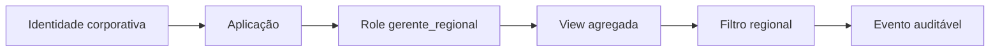

# Estudo de Caso — DataRetail S.A.

Gerentes regionais da DataRetail S.A. precisam acompanhar vendas das lojas sob sua responsabilidade. A tabela de pedidos também contém identificadores de clientes e dados operacionais desnecessários ao relatório.

## Contrato

A equipe publica `analytics.vw_vendas_loja`, com grão diário e apenas loja, data, quantidade e receita. O role `gerente_regional` recebe `SELECT` nessa view, sem acesso às tabelas `core`.

```sql
CREATE VIEW analytics.vw_vendas_loja AS
SELECT loja_id,
       CAST(criado_em AS DATE) AS data,
       COUNT(*) AS pedidos,
       SUM(valor) AS receita
FROM core.pedidos
WHERE status = 'pago'
GROUP BY loja_id, CAST(criado_em AS DATE);

GRANT USAGE ON SCHEMA analytics TO gerente_regional;
GRANT SELECT ON analytics.vw_vendas_loja TO gerente_regional;
```

A política complementar restringe lojas pela região da sessão. A aplicação define o contexto a partir da identidade corporativa, em transação, e o limpa antes de devolver a conexão ao pool.

## Governança

- owner de negócio: Diretoria Comercial;
- owner técnico: Plataforma de Dados;
- classificação: interno agregado;
- finalidade: acompanhamento de vendas;
- revisão de acesso: trimestral;
- logs: identidade, view, horário, região e fingerprint;
- teste: gerente não lê `core.pedidos` nem outra região.



O desenho limita dados, operações, linhas e duração, enquanto mantém um contrato compreensível para consumidores.
