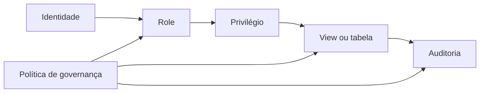

# Módulo 07 — Views, Segurança e Governança SQL

O banco não é apenas armazenamento: ele publica contratos, aplica limites de acesso e registra responsabilidades. Este módulo conecta abstração relacional, privilégio mínimo, segurança por linha e coluna, consultas parametrizadas, auditoria e ciclo de vida governado.

## Percurso

1. [[01-Objetivos|Objetivos]]
2. [[02-Introducao|Introdução]]
3. [[03-Views-Contratos-Abstracao-e-Dependencias|Views, Contratos, Abstração e Dependências]]
4. [[04-Views-Materializadas-Atualizacao-e-Consistencia|Views Materializadas, Atualização e Consistência]]
5. [[05-Identidades-Roles-Grants-Ownership-e-Privilegios|Identidades, Roles, Grants, Ownership e Privilégios]]
6. [[06-Menor-Privilegio-Separacao-de-Funcoes-e-Acesso|Menor Privilégio, Separação de Funções e Acesso]]
7. [[07-Seguranca-por-Linha-Coluna-Mascaramento-e-Privacidade|Segurança por Linha, Coluna, Mascaramento e Privacidade]]
8. [[08-SQL-Injection-Parametros-e-SQL-Dinamico-Seguro|SQL Injection, Parâmetros e SQL Dinâmico Seguro]]
9. [[09-Auditoria-Lineage-Classificacao-e-Ciclo-de-Vida|Auditoria, Lineage, Classificação e Ciclo de Vida]]
10. [[10-Estudo-de-Caso-DataRetail|Estudo de Caso — DataRetail S.A.]]
11. [[11-Resumo|Resumo]]
12. [[12-Perguntas-de-Entrevista|Perguntas de Entrevista]]
13. [[13-Exercicios|Exercícios]] e [[13-Gabarito|Gabarito]]
14. [[14-Laboratorio|Laboratório]] e [[14-Solucao|Solução]]
15. [[15-Referencias|Referências]]

