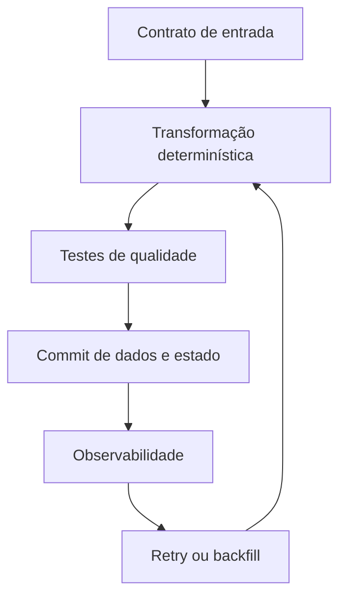

# Introdução

Uma consulta interativa é avaliada pelo resultado imediato. Em um pipeline, o mesmo SQL participa de agenda, dependências, retries, backfills, contratos e custos. Falhas podem ocorrer entre leitura, escrita e avanço do estado; dados podem chegar atrasados ou repetidos.

A solução exige quatro propriedades: transformação determinística, chave estável, fronteira transacional e estado de progresso recuperável. Na DataRetail S.A., pedidos reenviados não podem duplicar receita, enquanto correções tardias precisam atualizar o fato já publicado.
