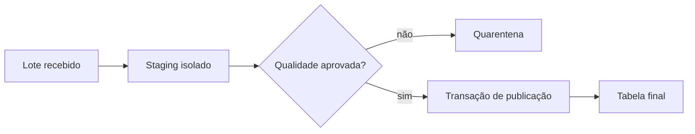

# Staging, Carga, Validação e Publicação Atômica

Staging recebe dados antes de incorporá-los ao produto estável. Essa camada permite validar schema, tipos, duplicidades, volume e regras de domínio sem expor estado parcial aos consumidores.



## Estratégias de publicação

- `INSERT` append-only para eventos imutáveis;
- upsert para estado mutável por chave;
- troca de tabela/partição para reconstruções;
- delete-and-insert de uma partição delimitada;
- criação de nova versão seguida por mudança de view.

Dados e marcador de execução devem avançar na mesma transação quando o mecanismo permite. Caso contrário, use protocolo recuperável que aceite repetição.

```sql
BEGIN;
INSERT INTO analytics.execucoes (execucao_id, status)
VALUES (:execucao_id, 'publicando');
-- validações e merge
UPDATE analytics.execucoes SET status = 'concluida' WHERE execucao_id = :execucao_id;
COMMIT;
```

> [!warning]
> Truncar a tabela publicada antes de uma carga longa cria janela de indisponibilidade e recuperação difícil.
