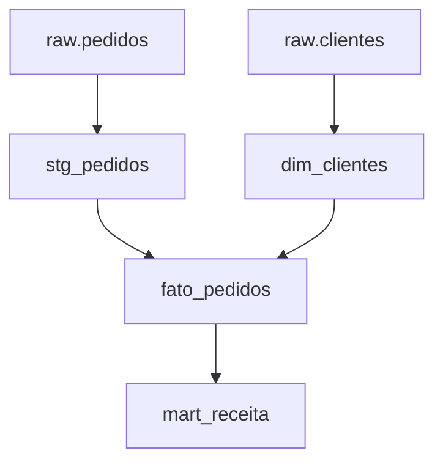

# ELT, Dependências, Testes, Orquestração e Observabilidade

No ELT, dados são carregados primeiro e transformados dentro da plataforma analítica. O orquestrador coordena dependências e retries; o SQL define transformação e invariantes. Embutir toda a lógica de negócio no DAG dificulta testes e portabilidade.

## Testes complementares

- schema e tipos;
- chave não nula e única;
- integridade referencial;
- valores de domínio;
- reconciliação de contagens e somas;
- freshness e volume esperado;
- equivalência entre execução completa e incremental.

Métricas operacionais incluem linhas lidas, inseridas, atualizadas, rejeitadas, duração, bytes processados, watermark anterior/novo e versão do código. Logs precisam carregar `run_id` comum ao orquestrador e ao banco.

Retry deve repetir uma unidade idempotente. Se uma tarefa produz estado parcial não reconhecível, o orquestrador apenas repete a corrupção.

> [!note]
> “Tarefa concluída” significa dados publicados e testes aprovados, não apenas comando SQL sem exceção.
