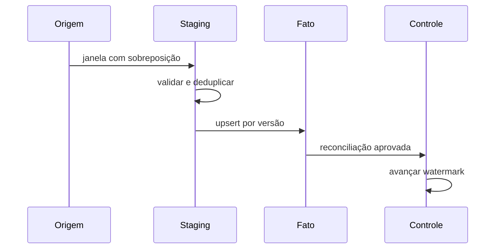

# Estudo de Caso — DataRetail S.A.

A DataRetail S.A. recebe pedidos por API e sincronização de lojas. Eventos podem ser reenviados, corrigidos e chegar até 24 horas atrasados. A receita diária não pode duplicar nem ignorar correções.

## Projeto

1. capturar limite superior estável da origem;
2. ler desde `watermark - 24 horas` até o limite;
3. carregar staging com `run_id`;
4. validar tipos, domínio, duplicidades e volume;
5. escolher a versão mais recente por `pedido_id`;
6. fazer upsert condicionado à versão;
7. reconciliar contagem e soma;
8. avançar watermark na mesma transação da publicação.

## Evidências

- mesmo lote executado duas vezes não muda o total;
- correção mais nova substitui valor anterior;
- evento antigo não regride o fato;
- lote inválido vai para quarentena;
- métricas registram inserções, atualizações e descartes;
- backfill por período usa o mesmo caminho de publicação.

O pipeline converge por chave e versão. O watermark otimiza a leitura; a idempotência protege a escrita.
