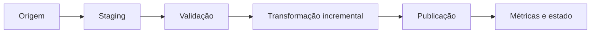

# Módulo 08 — SQL em Pipelines e Plataformas Analíticas

SQL em pipelines precisa produzir o mesmo estado correto diante de reexecução, atraso, duplicidade e falha parcial. Este módulo transforma consultas isoladas em unidades operacionais observáveis, incrementais e portáveis.

## Percurso

1. [[01-Objetivos|Objetivos]]
2. [[02-Introducao|Introdução]]
3. [[03-SQL-como-Unidade-de-Pipeline-Contratos-e-Execucao|SQL como Unidade de Pipeline, Contratos e Execução]]
4. [[04-Staging-Carga-Validacao-e-Publicacao-Atomica|Staging, Carga, Validação e Publicação Atômica]]
5. [[05-Incrementalidade-Watermarks-Janelas-e-Dados-Atrasados|Incrementalidade, Watermarks, Janelas e Dados Atrasados]]
6. [[06-Deduplicacao-Upsert-MERGE-e-Idempotencia|Deduplicação, Upsert, MERGE e Idempotência]]
7. [[07-Modelagem-Analitica-Fatos-Dimensoes-SCD-e-Snapshots|Modelagem Analítica, Fatos, Dimensões, SCD e Snapshots]]
8. [[08-ELT-Dependencias-Testes-Orquestracao-e-Observabilidade|ELT, Dependências, Testes, Orquestração e Observabilidade]]
9. [[09-Warehouses-Distribuidos-Particionamento-Custo-e-Portabilidade|Warehouses Distribuídos, Particionamento, Custo e Portabilidade]]
10. [[10-Estudo-de-Caso-DataRetail|Estudo de Caso — DataRetail S.A.]]
11. [[11-Resumo|Resumo]]
12. [[12-Perguntas-de-Entrevista|Perguntas de Entrevista]]
13. [[13-Exercicios|Exercícios]] e [[13-Gabarito|Gabarito]]
14. [[14-Laboratorio|Laboratório]] e [[14-Solucao|Solução]]
15. [[15-Referencias|Referências]]

