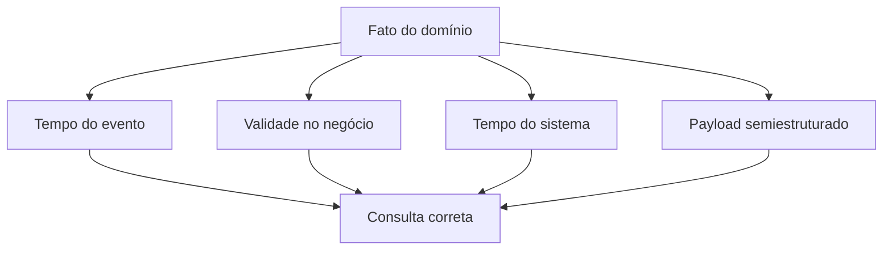

# Introdução

“Quando ocorreu?” pode significar instante do evento, registro na origem, ingestão ou conhecimento pelo banco. “Qual era o estado?” exige validade. Do mesmo modo, um campo JSON pode conter número, texto, ausente ou `null`, estados que não são equivalentes.

O modelo relacional continua responsável por chaves, restrições e relações. JSON é valioso para atributos esparsos, envelopes e evolução controlada, mas campos essenciais e frequentemente consultados merecem contrato explícito.
