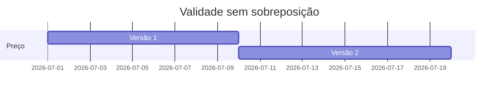

# Intervalos, Validade, Overlaps e Consultas As Of

Intervalos semiabertos `[início, fim)` incluem o início e excluem o fim. Versões adjacentes podem compartilhar a fronteira sem sobreposição.

```sql
SELECT preco_centavos
FROM historico_precos
WHERE produto_id = :produto_id
  AND valido_desde <= :instante
  AND (valido_ate > :instante OR valido_ate IS NULL);
```

Dois intervalos `[a, b)` e `[c, d)` se sobrepõem quando `a < d AND c < b`. Para fim aberto, use tipo range, infinito explícito ou lógica coerente com `NULL`.



Constraints simples garantem `valido_desde < valido_ate`; impedir sobreposição por chave pode exigir exclusion constraint, trigger ou transação serializada, conforme o SGBD.

> [!tip]
> Defina a precisão da fronteira. Subtrair um milissegundo para simular intervalo fechado cria lacunas e depende da precisão do tipo.
