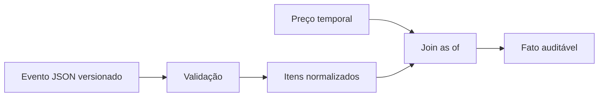

# Estudo de Caso — DataRetail S.A.

A DataRetail S.A. precisa reconstruir o preço válido quando cada pedido ocorreu e conservar atributos específicos de canais. Preços recebem correções retroativas; itens chegam em JSON versionado.

## Modelo

- `historico_precos`: produto, valor e intervalo `[valido_desde, valido_ate)`;
- `eventos_pedido`: instante do evento, ingestão, versão e payload JSON;
- `itens_pedido`: projeção normalizada dos itens para análise;
- payload bruto preservado para auditoria e reprocessamento.

```sql
SELECT i.pedido_id, i.sku, p.preco_centavos
FROM itens_pedido AS i
JOIN historico_precos AS p
  ON p.produto_id = i.produto_id
 AND p.valido_desde <= i.ocorrido_em
 AND (p.valido_ate > i.ocorrido_em OR p.valido_ate IS NULL);
```

## Controles

- impedir intervalos de preço sobrepostos por produto;
- armazenar instantes em UTC e timezone da loja separadamente;
- validar `schema_version` e tipos do payload;
- deduplicar eventos antes de expandir itens;
- comparar soma dos itens com total do pedido;
- reprocessar projeções quando o parser evoluir.



O payload flexível preserva particularidades; as relações tipadas sustentam chaves, histórico e métricas confiáveis.
