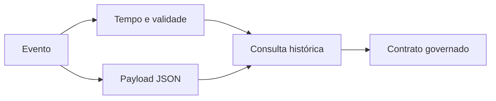

# Módulo 09 — Dados Temporais e Semiestruturados em SQL

Tempo e dados semiestruturados ampliam o modelo relacional sem eliminar a necessidade de contratos. Este módulo trata instantes, intervalos, histórico, JSON, arrays, indexação e evolução com semântica explícita.

## Percurso

1. [[01-Objetivos|Objetivos]]
2. [[02-Introducao|Introdução]]
3. [[03-Instantes-Datas-Duracoes-Timezones-e-Calendarios|Instantes, Datas, Durações, Timezones e Calendários]]
4. [[04-Intervalos-Validade-Overlaps-e-Consultas-As-Of|Intervalos, Validade, Overlaps e Consultas As Of]]
5. [[05-Tempo-de-Evento-Sistema-e-Modelagem-Bitemporal|Tempo de Evento, Sistema e Modelagem Bitemporal]]
6. [[06-JSON-Modelagem-Validacao-Nulos-e-Tipos|JSON, Modelagem, Validação, Nulos e Tipos]]
7. [[07-Consulta-Expansao-e-Agregacao-de-JSON-e-Arrays|Consulta, Expansão e Agregação de JSON e Arrays]]
8. [[08-Indices-JSON-Colunas-Geradas-e-Desempenho|Índices JSON, Colunas Geradas e Desempenho]]
9. [[09-Evolucao-de-Schema-Qualidade-e-Portabilidade|Evolução de Schema, Qualidade e Portabilidade]]
10. [[10-Estudo-de-Caso-DataRetail|Estudo de Caso — DataRetail S.A.]]
11. [[11-Resumo|Resumo]]
12. [[12-Perguntas-de-Entrevista|Perguntas de Entrevista]]
13. [[13-Exercicios|Exercícios]] e [[13-Gabarito|Gabarito]]
14. [[14-Laboratorio|Laboratório]] e [[14-Solucao|Solução]]
15. [[15-Referencias|Referências]]

