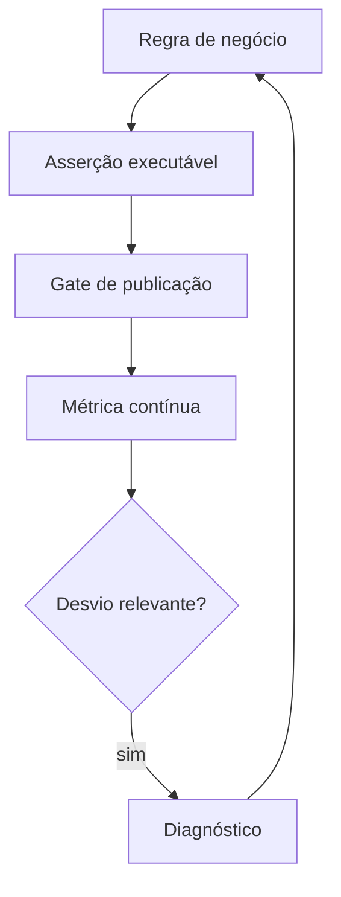

# Introdução

Uma consulta pode executar sem erro e produzir dados incorretos. Fanout, janela incompleta, timezone errado e mudança de domínio são falhas sem exceção técnica. Testes verificam hipóteses antes da publicação; observabilidade detecta comportamento inesperado durante a operação.

Na DataRetail S.A., a soma de pedidos pagos precisa reconciliar com a origem, chaves devem ser únicas e o fechamento diário deve cumprir freshness. Cada regra terá owner, severidade e resposta definida.
