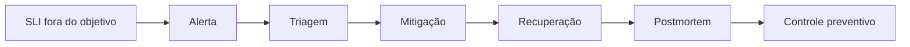

# SLOs, Alertas, Incidentes e Melhoria Contínua

Um SLI mede comportamento; um SLO define alvo; um SLA formaliza consequência externa. Para dados, exemplos incluem freshness, completude, sucesso de execução e tempo de recuperação.

```text
SLI: percentual de dias com mart_receita publicado até 06:00
SLO: 99,5% em janela móvel de 90 dias
```

Alertas devem ser acionáveis, possuir owner, severidade, contexto, runbook e condição de recuperação. Páginas são adequadas a impacto imediato; tickets atendem degradações que toleram horário comercial.



Postmortem sem culpa descreve impacto, linha do tempo, causa, fatores contribuintes, detecção e ações com responsáveis e prazos.
