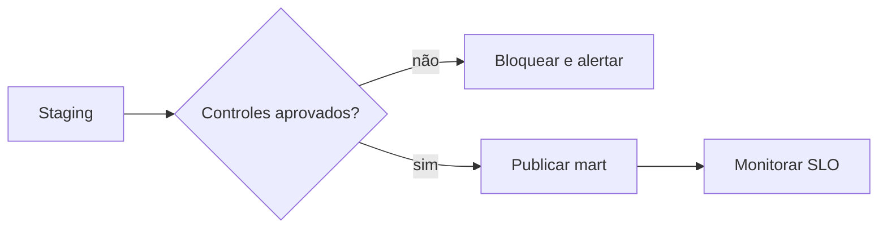

# Estudo de Caso — DataRetail S.A.

O mart diário de receita da DataRetail S.A. deve estar pronto às 06:00. Um incidente duplicou pedidos de uma loja sem alterar a contagem global porque outra origem ficou incompleta.

## Controles implantados

- chave única por pedido;
- reconciliação por data, loja e canal;
- soma de valor e contagem distinta;
- teste de integridade entre fato e dimensão;
- freshness por origem;
- comparação da distribuição de status;
- execução repetida para provar idempotência;
- `run_id` e versão em todas as métricas.

```sql
SELECT origem, loja_id,
       COUNT(*) AS linhas,
       COUNT(DISTINCT pedido_id) AS pedidos,
       SUM(valor_centavos) AS receita
FROM staging_pedidos
GROUP BY origem, loja_id;
```

O gate bloqueia publicação em duplicidade ou divergência financeira. Atraso pequeno de uma origem não crítica gera ticket; divergência de receita gera incidente imediato.


