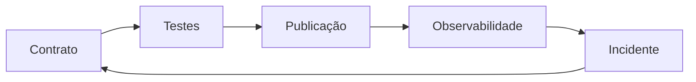

# Módulo 10 — Testes, Qualidade e Observabilidade SQL

Este módulo encerra o Volume 04 transformando regras SQL em evidências repetíveis: testes de unidade e integração, constraints, reconciliação, detecção de anomalias, métricas operacionais e resposta a incidentes.

## Percurso

1. [[01-Objetivos|Objetivos]]
2. [[02-Introducao|Introdução]]
3. [[03-Piramide-de-Testes-Fixtures-e-Determinismo|Pirâmide de Testes, Fixtures e Determinismo]]
4. [[04-Constraints-Assercoes-e-Testes-de-Contrato|Constraints, Asserções e Testes de Contrato]]
5. [[05-Reconciliacao-Completude-Unicidade-e-Integridade|Reconciliação, Completude, Unicidade e Integridade]]
6. [[06-Testes-de-Transformacao-Regressao-e-Propriedades|Testes de Transformação, Regressão e Propriedades]]
7. [[07-Freshness-Volume-Distribuicao-e-Deteccao-de-Anomalias|Freshness, Volume, Distribuição e Detecção de Anomalias]]
8. [[08-Metricas-Logs-Lineage-e-Diagnostico-Operacional|Métricas, Logs, Lineage e Diagnóstico Operacional]]
9. [[09-SLOs-Alertas-Incidentes-e-Melhoria-Continua|SLOs, Alertas, Incidentes e Melhoria Contínua]]
10. [[10-Estudo-de-Caso-DataRetail|Estudo de Caso — DataRetail S.A.]]
11. [[11-Resumo|Resumo]]
12. [[12-Perguntas-de-Entrevista|Perguntas de Entrevista]]
13. [[13-Exercicios|Exercícios]] e [[13-Gabarito|Gabarito]]
14. [[14-Laboratorio|Laboratório]] e [[14-Solucao|Solução]]
15. [[15-Referencias|Referências]]

