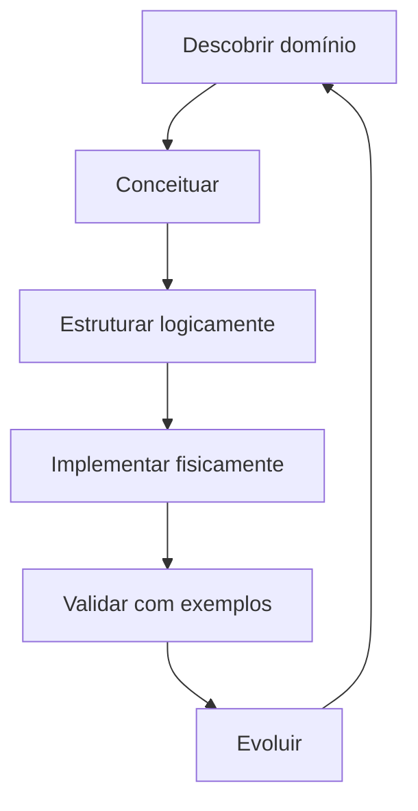

# Introdução

Modelagem não começa pela criação de tabelas. Começa por perguntas: o que existe no domínio, como é identificado, quais fatos podem ocorrer, que regras nunca podem ser violadas e que histórico precisa ser preservado.

O modelo reduz ambiguidades entre negócio, software, dados e operação. Ele não é fotografia permanente: muda com o domínio, mas deve evoluir de forma explícita e compatível.
