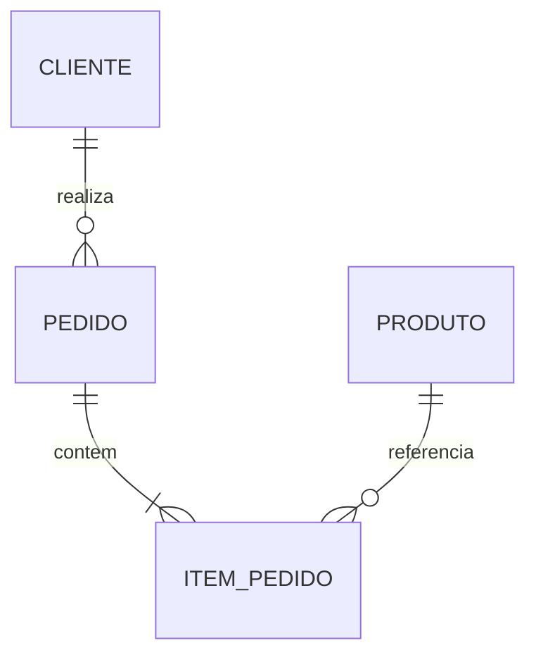

# Entidades, Atributos, Identidade e Relacionamentos

Uma entidade representa algo distinguível no domínio. Atributos descrevem propriedades; relacionamentos expressam associações com significado próprio.

Identidade responde se duas observações representam o mesmo objeto. Chave natural vem do domínio; chave substituta é criada pelo sistema. A substituta não elimina a regra de unicidade natural quando ela existe.

Relacionamentos podem ter atributos. O preço praticado e a quantidade pertencem a `ITEM_PEDIDO`, não ao produto nem ao pedido isoladamente.

> [!warning]
> Nomes genéricos como `tipo`, `codigo` e `data` escondem contexto. Prefira `status_pedido`, `codigo_produto` e `criado_em`.
