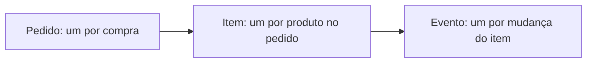

# Granularidade, Cardinalidade, Opcionalidade e Tempo

Grão declara o que uma ocorrência representa: um pedido, uma linha de pedido ou um estado diário. Misturar grãos é fonte recorrente de duplicidade e métricas erradas.

Cardinalidade define quantas ocorrências podem participar: um cliente realiza zero ou muitos pedidos; cada pedido pertence a exatamente um cliente. Opcionalidade precisa refletir o ciclo de vida, não apenas o estado final ideal.

## Tempo

- atributos de estado representam o valor atual;
- eventos representam mudanças ocorridas;
- versões preservam histórico;
- intervalos representam validade;
- snapshots registram estado em momentos definidos.

> [!warning]
> Adicionar uma coluna `data` não torna o modelo temporal. É necessário definir o que o instante representa e como correções são registradas.
