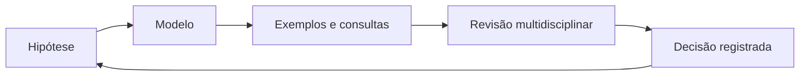

# Processo de Modelagem, Revisão e Evolução

Modelagem é iterativa. Um fluxo saudável produz artefatos suficientes para decisão, valida com cenários reais e registra trade-offs.

1. delimitar contexto e stakeholders;
2. construir glossário e exemplos;
3. identificar entidades, eventos e regras;
4. declarar identidade, grão e tempo;
5. desenhar modelo conceitual;
6. derivar estrutura lógica e física;
7. validar com consultas, comandos e contraexemplos;
8. revisar segurança, operação e evolução;
9. registrar decisão e owner.

Revisões devem incluir negócio, engenharia, operação, segurança e consumidores relevantes. Mudanças usam compatibilidade, migração e observabilidade, como em [[08-Expand-Contract-Backfill-Compatibilidade-e-Rollback|expand-contract]].
