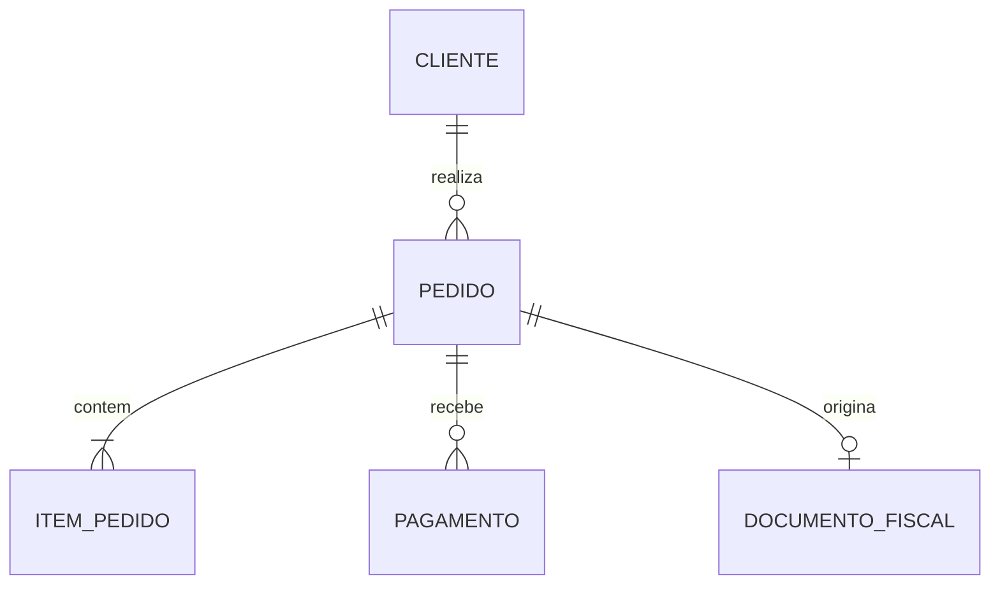

# Estudo de Caso — DataRetail S.A.

A DataRetail S.A. precisa unificar pedidos de lojas e e-commerce. “Venda” era usada para carrinho, pedido pago e documento fiscal, gerando métricas incompatíveis.

## Descoberta

- `Pedido` representa a intenção confirmada de compra;
- `ItemPedido` representa produto, quantidade e preço praticado;
- `Pagamento` registra tentativas e liquidações;
- `Faturamento` representa emissão fiscal;
- cancelamentos são eventos, não exclusão do pedido;
- identificadores da origem coexistem com identidade corporativa.

## Invariantes

- item pertence a exatamente um pedido;
- quantidade é positiva;
- preço praticado não muda quando o catálogo muda;
- um identificador de origem é único dentro do canal;
- status segue transições válidas.

O modelo separa conceitos antes confundidos e oferece base para modelos relacionais e dimensionais posteriores.
