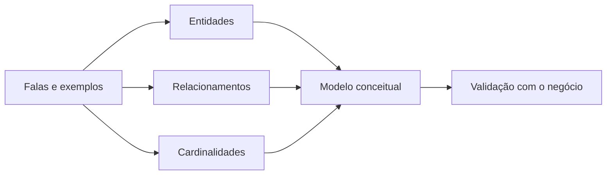

# Introdução

O modelo Entidade-Relacionamento, proposto por Peter Chen, descreve conjuntos de coisas distinguíveis, suas propriedades e associações. Seu valor não está em produzir um desenho bonito, mas em expor decisões que frases vagas escondem.

O diagrama é acompanhado por glossário e regras textuais. Nem toda regra cabe visualmente, e sobrecarregar a figura reduz sua utilidade.
