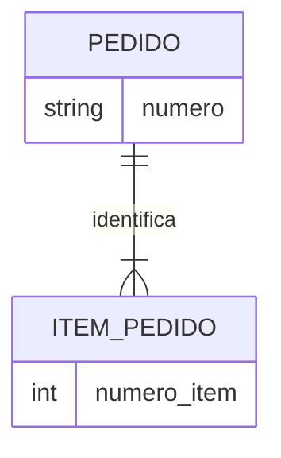

# Entidades Fortes, Fracas e Identidade

Uma entidade forte possui identidade independente no contexto. Uma entidade fraca depende da identidade de outra e de uma chave parcial. O item 2 do pedido 100 é identificado por `(pedido, número do item)`.

## Testes de entidade

- existem múltiplas ocorrências distinguíveis?
- possui ciclo de vida relevante?
- participa de relacionamentos?
- sua identidade permanece quando atributos mudam?
- o conceito existe no vocabulário do domínio?

Identidade não deve depender de atributo mutável como e-mail. Quando a chave natural é composta ou sujeita a integração, uma identidade corporativa pode ser necessária, sem apagar os identificadores das fontes.

> [!warning]
> Criar entidade para cada substantivo produz abstrações falsas; “endereço” pode ser valor composto, entidade compartilhada ou snapshot conforme o domínio.
