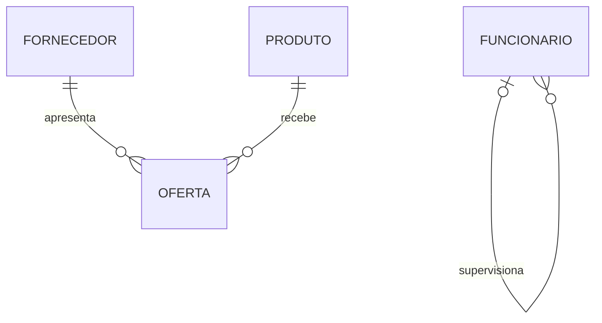

# Relacionamentos, Papéis, Graus e Atributos

Relacionamento expressa uma associação semântica entre ocorrências. Nomeie-o com verbo: cliente **realiza** pedido; funcionário **supervisiona** funcionário.

## Grau e papéis

- binário: duas entidades participantes;
- recursivo: a mesma entidade assume papéis diferentes;
- ternário: três participantes formam um fato indivisível.

Preço negociado e prazo pertencem à `OFERTA`, associação entre fornecedor e produto. Transformar relacionamento ternário em vários binários só é válido se preservar a regra; “fornecedor fornece peça para projeto” pode depender dos três participantes simultaneamente.

> [!note]
> Um relacionamento com identidade, atributos e ciclo de vida costuma ser promovido a entidade associativa.
