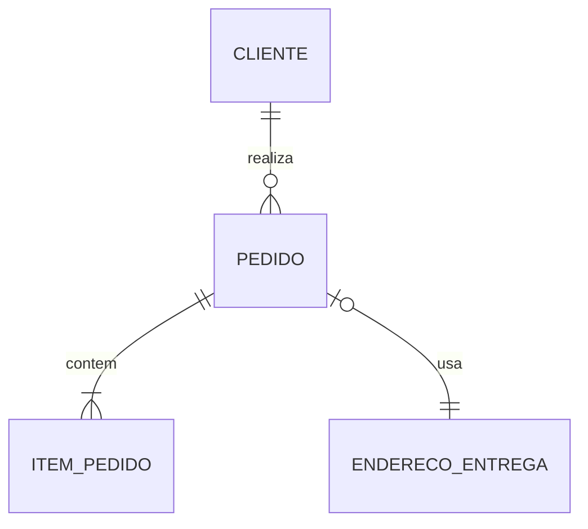

# Cardinalidade, Opcionalidade e Restrições de Participação

Cardinalidade máxima pode ser um ou muitos; mínima pode ser zero ou um. A combinação produz `0..1`, `1..1`, `0..N` ou `1..N`.

Pergunte nos dois sentidos e considere todo o ciclo de vida. Um pedido em rascunho pode ter zero itens, enquanto pedido confirmado exige ao menos um. Isso pode indicar estados com regras distintas.

Participação total significa que toda ocorrência participa; parcial permite ausência. Limites superiores maiores que um precisam de regra operacional, mesmo que a notação mostre apenas “muitos”.

> [!warning]
> Cardinalidade não deve ser inferida da amostra atual. “Nunca vimos dois” não prova limite de negócio igual a um.
