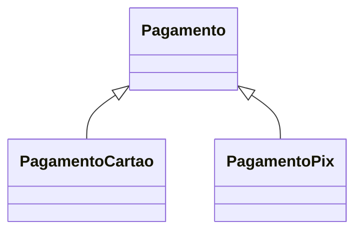

# Entidades Associativas, Hierarquias e Generalização

Entidade associativa representa relacionamento muitos-para-muitos com atributos ou identidade. `MATRICULA` conecta aluno e turma e registra data e situação.

Generalização reúne propriedades comuns em supertipo; especialização cria subtipos. Restrições importantes:

- disjunta ou sobreposta;
- total ou parcial;
- definida por regra ou classificação manual.

Use subtipo quando existirem atributos, relações ou regras exclusivas. Uma coluna `tipo` não exige hierarquia se todas as ocorrências compartilham a mesma estrutura.

Hierarquias organizacionais e de categorias podem ser recursivas, mas precisam definir ciclos, múltiplos pais, validade e profundidade.

> [!tip]
> Valide se uma ocorrência pode mudar de subtipo e o que acontece com atributos exclusivos nessa transição.
