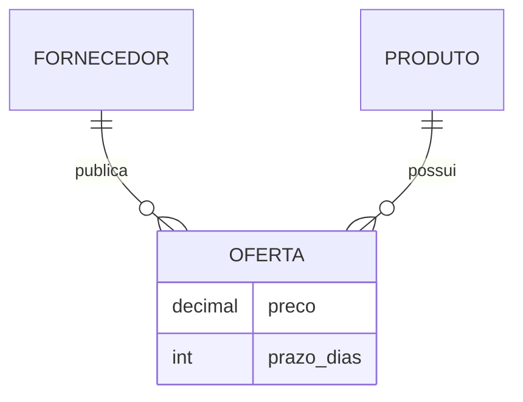

# Notações Chen, Crow's Foot, UML e Mermaid

Chen representa entidades, relacionamentos e atributos como formas distintas. Crow's Foot compacta cardinalidades nas extremidades. UML oferece classes, associações e generalização. Mermaid facilita diagramas versionáveis no Obsidian.

| Objetivo | Notação adequada |
|---|---|
| ensino conceitual detalhado | Chen |
| leitura rápida de dados | Crow's Foot |
| integração com desenho de software | UML |
| documentação como código | Mermaid ER/classDiagram |

Mermaid não representa toda nuance de Chen. Complemente diagramas com catálogo de regras, definições e exemplos.

> [!important]
> Escolha uma convenção, inclua legenda e mantenha consistência. O leitor não deve adivinhar se círculo significa zero, opcional ou estado.
