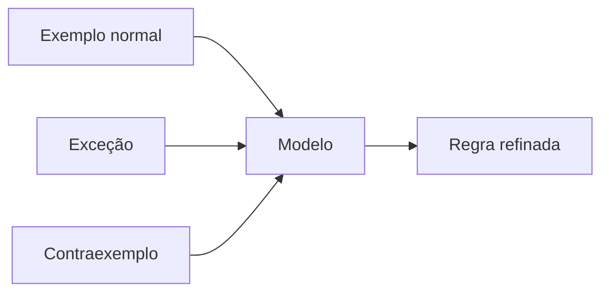

# Descoberta, Validação, Antipadrões e Evolução

Descubra o modelo por eventos, comandos, políticas e exemplos. Valide contando histórias: criar, alterar, cancelar, fundir, corrigir e consultar no passado.

## Antipadrões

- entidade `DADOS` ou `INFORMACAO` sem significado;
- relacionamento muitos-para-muitos sem regra;
- atributos repetidos `telefone1`, `telefone2`;
- status que mistura processos independentes;
- generalização apenas para reutilizar campos;
- entidade que representa tela ou relatório;
- ausência de identidade e de tempo.

Evolução conceitual precede migração técnica: redefinir cliente, dividir pedido ou introduzir assinatura altera contratos e métricas. Registre decisão, impacto e plano de transição.

> [!tip]
> Peça ao especialista um exemplo que o modelo atual não consegue representar; exceções revelam regras ocultas.
