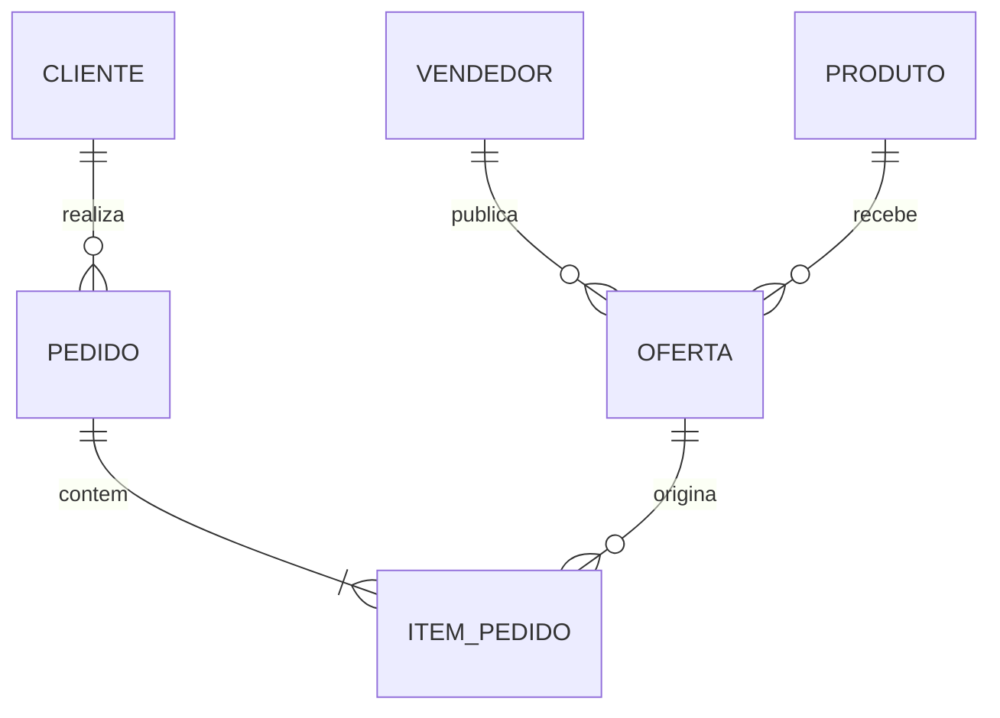

# Estudo de Caso — DataRetail S.A.

A DataRetail S.A. abriu seu marketplace. Produtos podem ser oferecidos por vários vendedores, com preço e prazo próprios. Um pedido contém ofertas específicas, não apenas produtos genéricos.

## Decisões

- `OFERTA` é entidade associativa entre vendedor e produto;
- sua identidade combina vendedor e código interno, com validade;
- preço praticado é snapshot em `ITEM_PEDIDO`;
- um pedido confirmado contém ao menos um item;
- oferta pode existir sem venda;
- cliente pode existir sem pedido;
- vendedor pode suspender oferta sem apagar histórico.

## Perguntas de validação

- o mesmo produto pode ter duas ofertas do mesmo vendedor?
- a oferta pode trocar de produto?
- um item pode ser dividido entre vendedores?
- como devolução parcial referencia o item original?

As respostas evitam um relacionamento N:N genérico incapaz de preservar preço, vendedor e histórico da compra.
