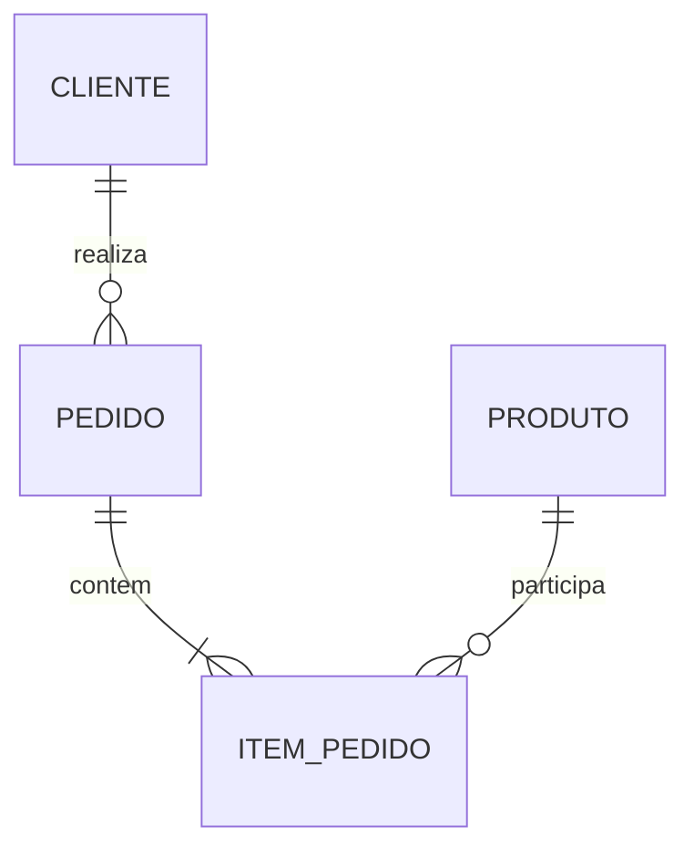

# Módulo 02 — Modelagem Conceitual e Entidade-Relacionamento

O modelo conceitual organiza a linguagem do domínio sem antecipar tabelas, tipos ou índices. Ele torna identidade, cardinalidade, opcionalidade e regras visíveis para validação conjunta.

## Percurso

1. [[01-Objetivos|Objetivos]]
2. [[02-Introducao|Introdução]]
3. [[03-Entidades-Fortes-Fracas-e-Identidade|Entidades Fortes, Fracas e Identidade]]
4. [[04-Atributos-Simples-Compostos-Multivalorados-e-Derivados|Atributos Simples, Compostos, Multivalorados e Derivados]]
5. [[05-Relacionamentos-Papeis-Graus-e-Atributos|Relacionamentos, Papéis, Graus e Atributos]]
6. [[06-Cardinalidade-Opcionalidade-e-Restricoes-de-Participacao|Cardinalidade, Opcionalidade e Restrições de Participação]]
7. [[07-Entidades-Associativas-Hierarquias-e-Generalizacao|Entidades Associativas, Hierarquias e Generalização]]
8. [[08-Notacoes-Chen-Crow-Foot-UML-e-Mermaid|Notações Chen, Crow's Foot, UML e Mermaid]]
9. [[09-Descoberta-Validacao-Antipadroes-e-Evolucao|Descoberta, Validação, Antipadrões e Evolução]]
10. [[10-Estudo-de-Caso-DataRetail|Estudo de Caso — DataRetail S.A.]]
11. [[11-Resumo|Resumo]]
12. [[12-Perguntas-de-Entrevista|Perguntas de Entrevista]]
13. [[13-Exercicios|Exercícios]] e [[13-Gabarito|Gabarito]]
14. [[14-Laboratorio|Laboratório]] e [[14-Solucao|Solução]]
15. [[15-Referencias|Referências]]

