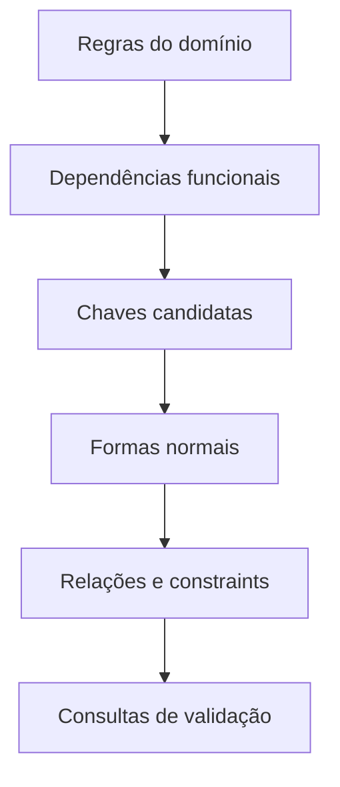

# Introdução

Uma planilha que repete nome de cliente em cada pedido parece prática, mas permite atualizar apenas algumas linhas, impede cadastrar cliente sem pedido e perde cadastro ao apagar a última venda. São anomalias de atualização, inserção e exclusão.

Normalizar não significa criar o maior número de tabelas. O objetivo é representar cada fato uma vez, no lugar em que sua identidade e dependências possam ser protegidas.
