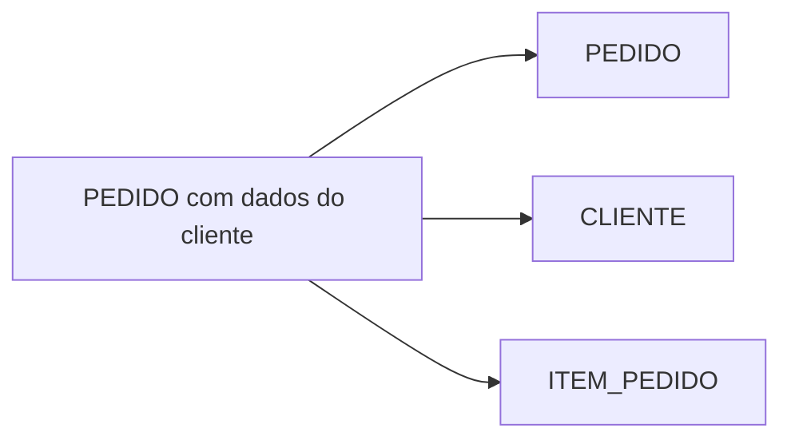

# Primeira, Segunda e Terceira Formas Normais

## Primeira Forma Normal

Relações possuem atributos definidos em domínios e uma tupla por ocorrência do grão. Listas em `produto_1`, `produto_2` ou texto separado por vírgula violam o desenho relacional útil.

## Segunda Forma Normal

Em 1FN, nenhum atributo não primo depende de parte própria de uma chave candidata composta. Em `ITEM(pedido_id, numero_item, cliente_nome)`, `cliente_nome` depende do pedido, não do item inteiro.

## Terceira Forma Normal

Para toda dependência não trivial `X → A`, `X` é superchave ou `A` é atributo primo. Isso remove dependência transitiva de atributos não chave.

> [!note]
> 2FN só acrescenta restrição quando existe chave candidata composta.
