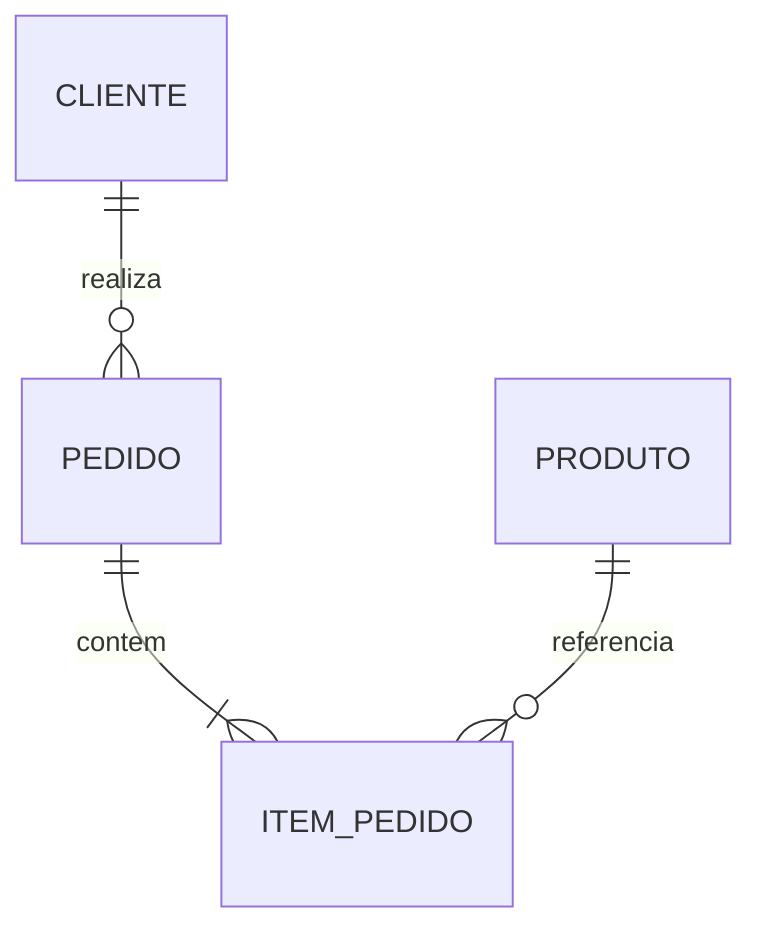

# Estudo de Caso — DataRetail S.A.

A DataRetail S.A. recebeu uma tabela legada com uma linha por item:

```text
VENDA(pedido_id, data, cliente_id, cliente_nome,
      numero_item, produto_id, produto_nome, quantidade, preco)
```

Dependências principais:

```text
pedido_id → data, cliente_id
cliente_id → cliente_nome
produto_id → produto_nome
(pedido_id, numero_item) → produto_id, quantidade, preco
```

O desenho repete cliente, produto e cabeçalho do pedido. A decomposição resulta em `CLIENTE`, `PRODUTO`, `PEDIDO` e `ITEM_PEDIDO`.



O preço permanece no item porque representa o valor praticado, não o preço atual do produto. Chaves estrangeiras preservam referências; a junção pelas chaves reconstrói a visão legada sem fatos espúrios.
