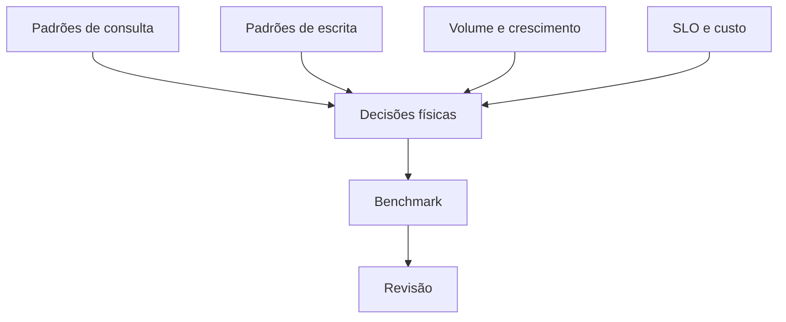

# Introdução

O mesmo modelo lógico pode ser implementado em banco transacional, warehouse colunar ou lakehouse. Cada ambiente possui unidade de I/O, concorrência, distribuição e custos distintos.

Uma otimização local pode prejudicar o sistema: índices aceleram leitura, mas ampliam escrita; partições ajudam pruning, mas podem criar muitos arquivos; desnormalização reduz joins, mas introduz consistência derivada.
