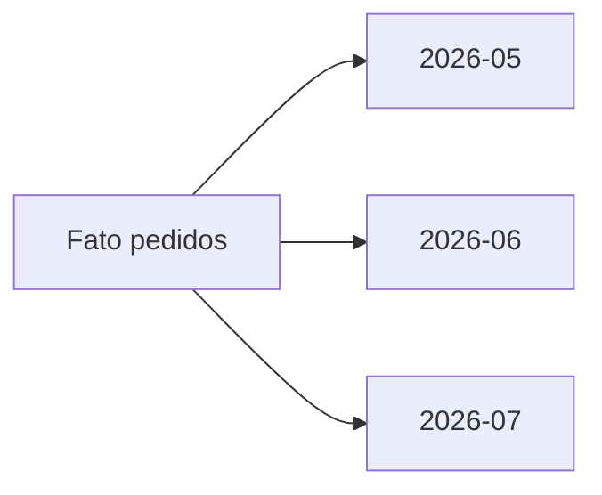

# Particionamento, Distribuição, Pruning e Skew

Particionamento divide uma relação em partes administráveis por faixa, lista ou hash. Ele ajuda retenção, carga, manutenção e pruning quando os predicados usam a chave compatível.

Partições excessivas elevam metadados e geram arquivos pequenos. Escolha granularidade pelo volume, frequência de consulta e unidade de manutenção.

Em plataformas distribuídas, a chave de distribuição busca balanceamento e colocalização. Uma loja dominante cria skew; uma chave de alta cardinalidade tende a distribuir melhor, mas pode exigir shuffle em joins.

> [!warning]
> Particionar não substitui índice nem melhora toda consulta. Sem filtro compatível, o sistema pode ler todas as partições.
