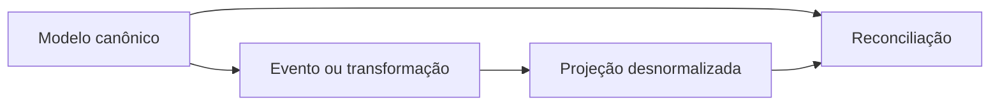

# Desnormalização, Projeções Materializadas e Consistência

Desnormalização duplica ou pré-calcula dados para um padrão de acesso. Exemplos: total do pedido, nome do cliente no documento histórico, agregado diário e documento de busca.

Toda redundância precisa responder:

- qual é a fonte canônica?
- como e quando a projeção é atualizada?
- qual atraso é aceitável?
- como detectar divergência?
- como reconstruir e fazer rollback?

Triggers oferecem atomicidade local, mas aumentam acoplamento. Views materializadas e pipelines permitem atualização assíncrona, exigindo freshness e idempotência.

> [!important]
> Cache sem estratégia de invalidação é uma cópia não governada do dado.
