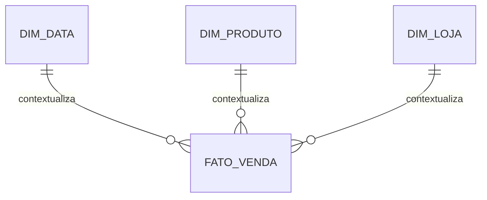

# Introdução

Sistemas operacionais registram transações; análise cruza processos, períodos e perspectivas. O modelo dimensional apresenta medidas no centro e contexto descritivo ao redor.

Denormalização dimensional não elimina rigor. Identidade, histórico, grão, aditividade e conformidade precisam ser mais explícitos porque muitos consumidores agregam dados diretamente.
