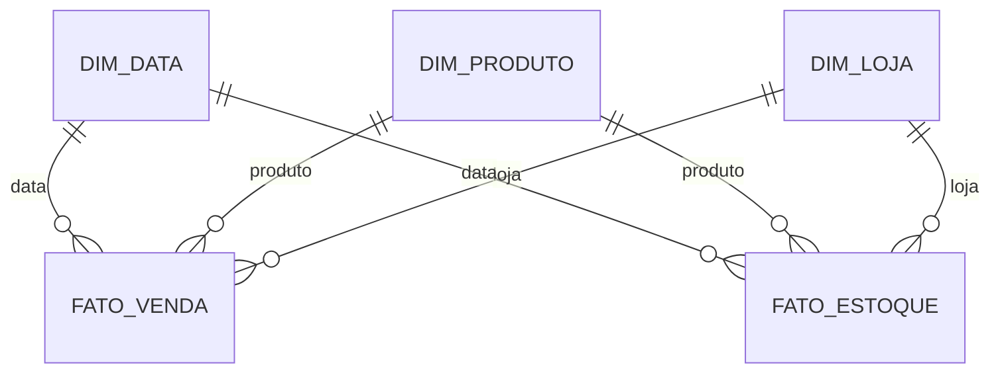

# Esquema Estrela, Snowflake e Constelações

Estrela conecta fato diretamente a dimensões desnormalizadas, favorecendo simplicidade. Snowflake normaliza hierarquias dimensionais, reduzindo redundância ao custo de mais joins. Constelação compartilha dimensões entre várias fatos.

Escolha snowflake quando governança, cardinalidade ou manutenção da hierarquia justificarem. Não normalize automaticamente dimensões pequenas.

> [!important]
> Fatos de grãos diferentes não devem ser juntados diretamente; agregue cada uma ao grão comum antes de combinar.
