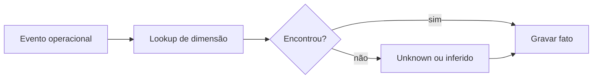

# Carga Dimensional, Lookups, Late Arriving e Unknown

A carga resolve chaves naturais para substitutas, aplica histórico e grava a fato com referências válidas. Dimensões normalmente são processadas antes das fatos.

Uma linha fato pode chegar antes da dimensão. Estratégias:

- membro desconhecido com chave reservada;
- placeholder inferido e enriquecido depois;
- quarentena até a dimensão chegar;
- retry com prazo definido.

Chave zero ou negativa pode representar desconhecido, não aplicável ou erro, mas cada significado deve ter membro distinto. `NULL` dificulta joins e agrupamento consistente.

> [!tip]
> Registre a chave natural na staging para refazer lookups e corrigir fatos atrasados.
