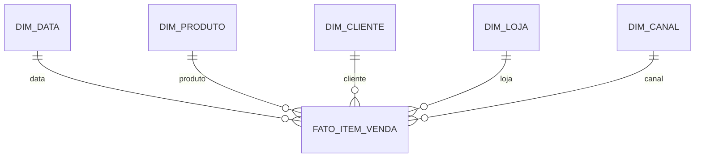

# Estudo de Caso — DataRetail S.A.

A DataRetail S.A. precisa analisar receita, quantidade e desconto por produto, cliente, loja, canal e data.

## Grão

Uma linha por item confirmado de pedido, na moeda da venda. Cancelamentos são eventos compensatórios ou atualização governada conforme contrato.

## Estrela

Medidas: quantidade, valor bruto, desconto e valor líquido em centavos. Número do pedido é dimensão degenerada. Produto, Loja e Data são conformados com estoque.

## Controles

- unicidade `(pedido_id, numero_item)`;
- soma líquida igual a bruto menos desconto;
- todas as dimensões resolvidas ou membro unknown explícito;
- reconciliação diária por canal;
- taxa média calculada a partir de componentes.

O grão atômico permite agregar por qualquer combinação dimensional sem duplicar medidas.
