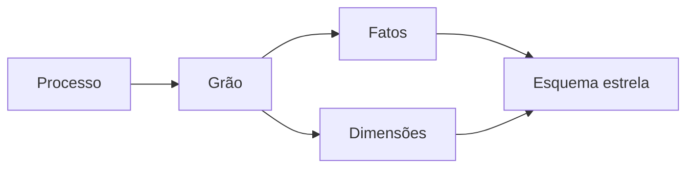

# Módulo 05 — Modelagem Dimensional, Fatos e Dimensões

Modelagem dimensional organiza eventos mensuráveis e seu contexto para consultas compreensíveis e previsíveis. O desenho começa no processo de negócio e no grão, não em relatórios isolados.

## Percurso

1. [[01-Objetivos|Objetivos]]
2. [[02-Introducao|Introdução]]
3. [[03-Processos-de-Negocio-Bus-Matrix-e-Declaracao-do-Grao|Processos de Negócio, Bus Matrix e Declaração do Grão]]
4. [[04-Tabelas-Fato-Medidas-e-Aditividade|Tabelas Fato, Medidas e Aditividade]]
5. [[05-Dimensoes-Atributos-Hierarquias-e-Conformidade|Dimensões, Atributos, Hierarquias e Conformidade]]
6. [[06-Chaves-Substitutas-Dimensoes-Degeneradas-Junk-e-Role-Playing|Chaves Substitutas, Dimensões Degeneradas, Junk e Role-Playing]]
7. [[07-Esquema-Estrela-Snowflake-e-Constelacoes|Esquema Estrela, Snowflake e Constelações]]
8. [[08-Carga-Dimensional-Lookups-Late-Arriving-e-Unknown|Carga Dimensional, Lookups, Late Arriving e Unknown]]
9. [[09-Testes-Performance-Semantica-e-Governanca-Dimensional|Testes, Performance, Semântica e Governança Dimensional]]
10. [[10-Estudo-de-Caso-DataRetail|Estudo de Caso — DataRetail S.A.]]
11. [[11-Resumo|Resumo]]
12. [[12-Perguntas-de-Entrevista|Perguntas de Entrevista]]
13. [[13-Exercicios|Exercícios]] e [[13-Gabarito|Gabarito]]
14. [[14-Laboratorio|Laboratório]] e [[14-Solucao|Solução]]
15. [[15-Referencias|Referências]]

