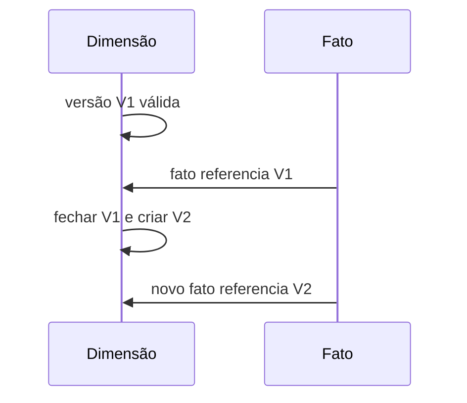

# Introdução

Se um cliente muda de segmento, vendas passadas devem aparecer no segmento antigo ou no atual? Ambas as respostas podem ser legítimas para perguntas diferentes. O modelo deve escolher e permitir uso correto.

SCD preserva mudanças de atributos; snapshots preservam estados; bridges representam muitos membros e hierarquias. Esses padrões exigem regras contra sobreposição e duplicação de medidas.
