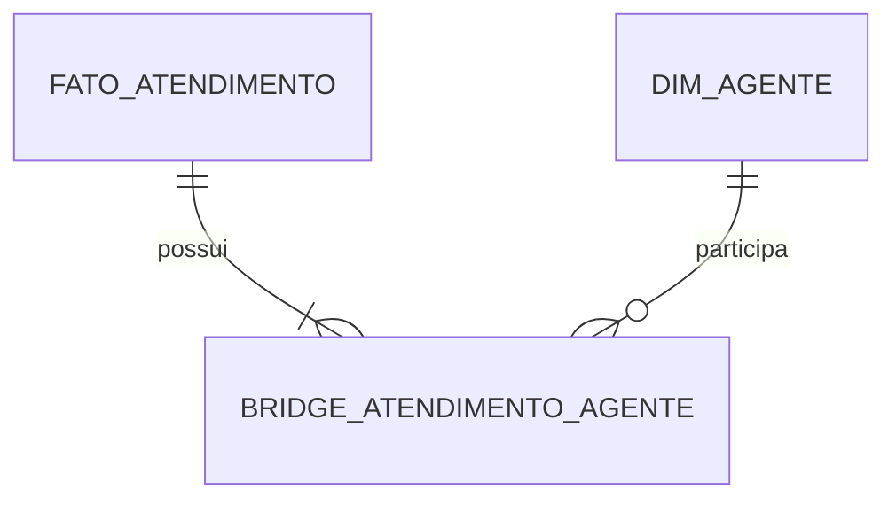

# Bridges, Relações Multivaloradas e Alocação

Bridge conecta uma fato ou dimensão a vários membros. Um atendimento pode ter vários agentes; um cliente pode pertencer a vários grupos.

Juntar a bridge multiplica a medida. Estratégias:

- contar distinto no grão original;
- alocar peso que soma 1 por grupo;
- analisar participação sem somar a medida;
- escolher membro primário com regra documentada.

Bridge precisa de chave do grupo quando o conjunto de membros é reutilizado e pode possuir validade histórica. Pesos são regras de negócio, não correção técnica universal.

> [!warning]
> Somar receita após expandir membros sem alocação duplica valores.
