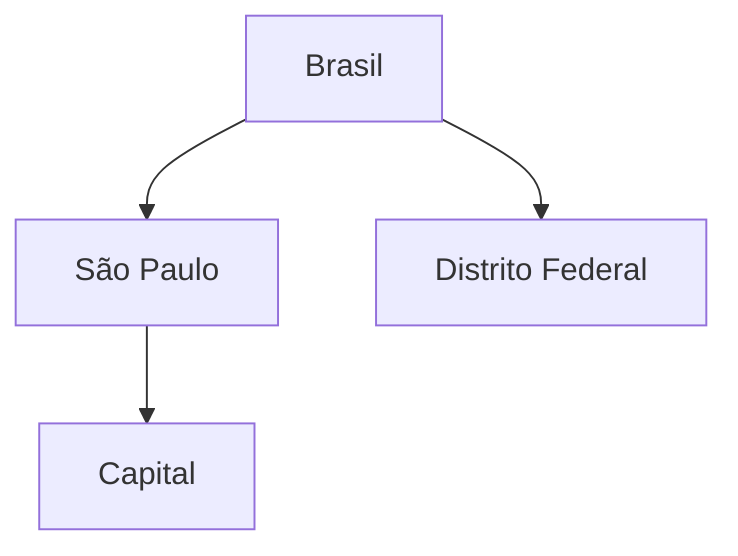

# Hierarquias Variáveis, Ragged e Parent-Child

Hierarquia balanceada possui níveis previsíveis; ragged permite caminhos que pulam níveis; parent-child representa autorreferência de profundidade variável.

Padrões físicos incluem:

- adjacency list: membro e pai;
- path enumerado: caminho materializado;
- closure/bridge: todos os pares ancestral-descendente;
- colunas por nível para hierarquia fixa.

Closure bridge acelera rollups e pode guardar distância, mas precisa ser reconstruída em mudanças. Hierarquia histórica exige validade do vínculo, não apenas do membro.

> [!tip]
> Teste ciclos, múltiplos pais, membros órfãos e alocação antes de permitir agregação hierárquica.
