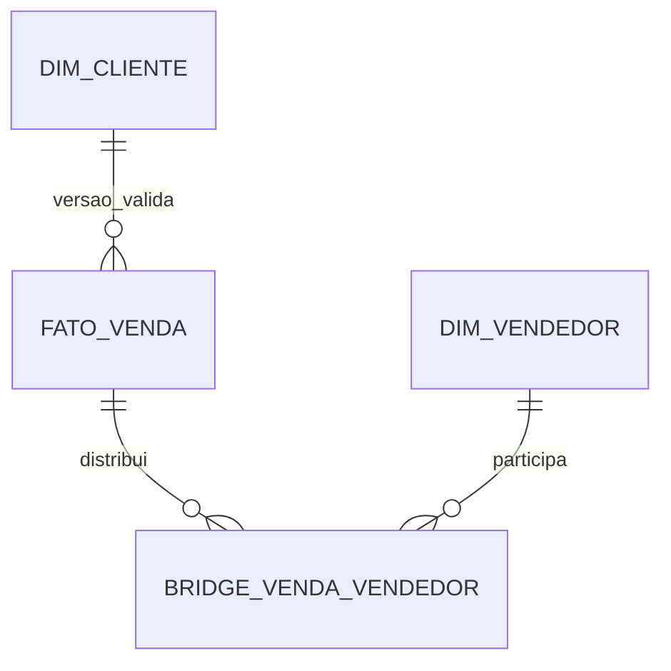

# Estudo de Caso — DataRetail S.A.

Clientes da DataRetail mudam de segmento. A análise financeira precisa do segmento praticado na venda; marketing quer reclassificar todo o histórico pelo segmento atual.

## Desenho

- `DIM_CLIENTE` usa SCD2 para segmento;
- a fato referencia `cliente_sk` válido no pedido;
- atributo `segmento_atual` pode ser exposto separadamente para visão reclassificada;
- mudanças retroativas dividem intervalos sob processo auditado.

Pedidos do marketplace podem envolver vários vendedores. Uma bridge item-vendedor armazena participação e peso de receita.

Controles impedem versões sobrepostas e exigem pesos iguais a 1. Assim a organização oferece visão histórica e atual sem duplicar receita.
