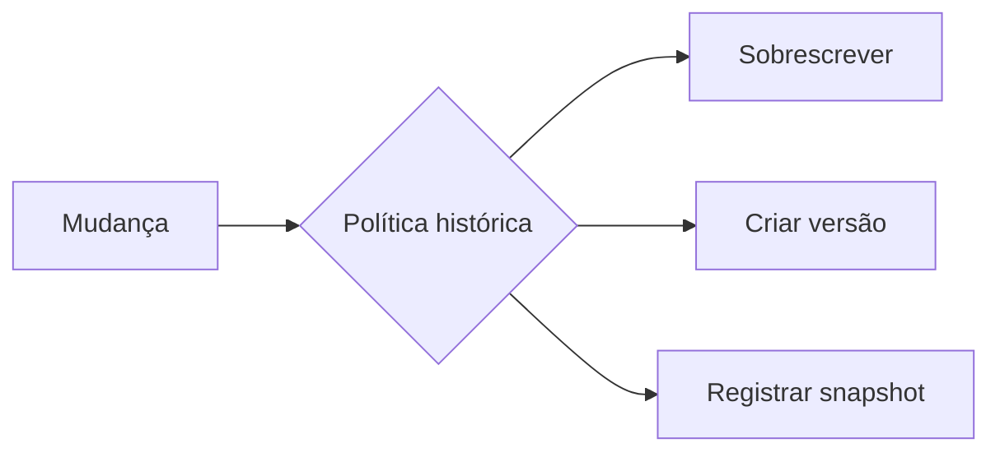

# Módulo 06 — Histórico Dimensional, SCD, Snapshots e Bridges

Modelos analíticos precisam decidir se uma mudança corrige, substitui ou cria uma nova versão. Este módulo trata Slowly Changing Dimensions, snapshots, relações multivaloradas, hierarquias e correções tardias.

## Percurso

1. [[01-Objetivos|Objetivos]]
2. [[02-Introducao|Introdução]]
3. [[03-Mudanca-Historico-Validade-e-Tempo-de-Conhecimento|Mudança, Histórico, Validade e Tempo de Conhecimento]]
4. [[04-SCD-Tipos-0-1-2-3-4-e-6|SCD Tipos 0, 1, 2, 3, 4 e 6]]
5. [[05-SCD-Tipo-2-Chaves-Intervalos-e-Lookup-Temporal|SCD Tipo 2, Chaves, Intervalos e Lookup Temporal]]
6. [[06-Snapshots-Periodicos-e-Acumulativos|Snapshots Periódicos e Acumulativos]]
7. [[07-Bridges-Relacoes-Multivaloradas-e-Alocacao|Bridges, Relações Multivaloradas e Alocação]]
8. [[08-Hierarquias-Variaveis-Ragged-e-Parent-Child|Hierarquias Variáveis, Ragged e Parent-Child]]
9. [[09-Late-Arriving-Correcoes-Testes-e-Governanca|Late Arriving, Correções, Testes e Governança]]
10. [[10-Estudo-de-Caso-DataRetail|Estudo de Caso — DataRetail S.A.]]
11. [[11-Resumo|Resumo]]
12. [[12-Perguntas-de-Entrevista|Perguntas de Entrevista]]
13. [[13-Exercicios|Exercícios]] e [[13-Gabarito|Gabarito]]
14. [[14-Laboratorio|Laboratório]] e [[14-Solucao|Solução]]
15. [[15-Referencias|Referências]]

