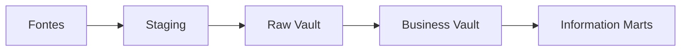

# Introdução

Integração empresarial recebe chaves divergentes, atributos em ritmos diferentes e regras que mudam. Um modelo monolítico acopla ingestão, historização e interpretação. Data Vault separa essas responsabilidades.

O Raw Vault preserva dados orientados à fonte com mínima transformação técnica. O Business Vault aplica regras derivadas. Marts oferecem modelos dimensionais, semânticos ou produtos específicos.
