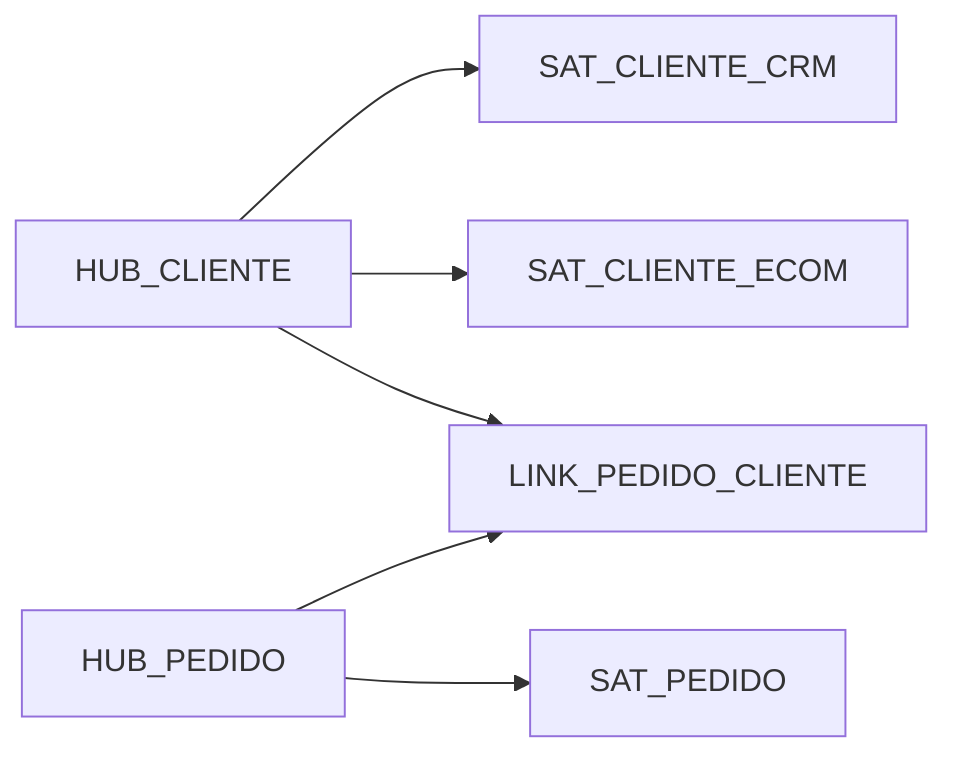

# Estudo de Caso — DataRetail S.A.

A DataRetail integra CRM, e-commerce e lojas. Clientes possuem identificadores por fonte; pedidos podem mudar de status e receber correções.

## Decisões

- `(sistema, cliente_id_origem)` é business key inicial;
- regra corporativa de identidade fica no Business Vault;
- Hubs preservam primeira fonte e carga;
- Satellites são separados por fonte e ritmo;
- Link representa relação pedido-cliente;
- status é historizado em Satellite;
- mart de vendas deriva fato e dimensão cliente conformada.

PIT diário acelera visão corrente. Todas as linhas mantêm record source e load timestamp, permitindo reconstrução e investigação.
