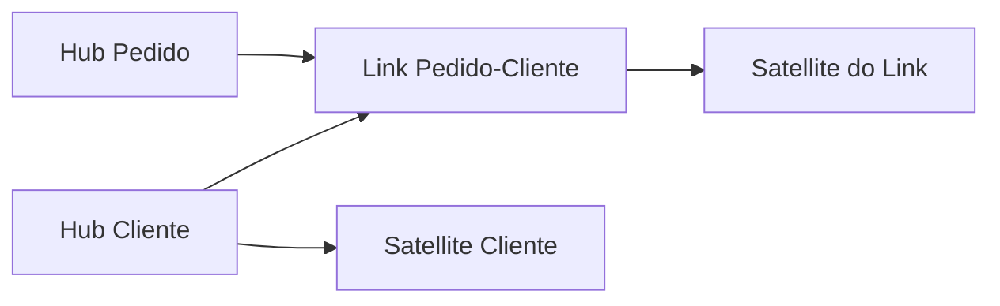

# Módulo 07 — Data Vault 2.0 e Integração Histórica

Data Vault separa identidades de negócio, relações e contexto histórico para absorver múltiplas fontes com auditabilidade e evolução incremental. Este módulo aborda o Raw Vault, o Business Vault e a entrega de marts.

## Percurso

1. [[01-Objetivos|Objetivos]]
2. [[02-Introducao|Introdução]]
3. [[03-Principios-Raw-Vault-Business-Vault-e-Arquitetura|Princípios, Raw Vault, Business Vault e Arquitetura]]
4. [[04-Hubs-Business-Keys-Identidade-e-Record-Source|Hubs, Business Keys, Identidade e Record Source]]
5. [[05-Links-Relacionamentos-Transacoes-e-Effectivity|Links, Relacionamentos, Transações e Effectivity]]
6. [[06-Satellites-Contexto-Historico-e-Rate-of-Change|Satellites, Contexto, Histórico e Rate of Change]]
7. [[07-Hash-Keys-Hashdiff-Canonicalizacao-e-Colisoes|Hash Keys, Hashdiff, Canonicalização e Colisões]]
8. [[08-Carga-Paralela-Idempotencia-Multi-Active-e-Delete|Carga Paralela, Idempotência, Multi-Active e Delete]]
9. [[09-PIT-Bridges-Business-Rules-Marts-e-Governanca|PIT, Bridges, Business Rules, Marts e Governança]]
10. [[10-Estudo-de-Caso-DataRetail|Estudo de Caso — DataRetail S.A.]]
11. [[11-Resumo|Resumo]]
12. [[12-Perguntas-de-Entrevista|Perguntas de Entrevista]]
13. [[13-Exercicios|Exercícios]] e [[13-Gabarito|Gabarito]]
14. [[14-Laboratorio|Laboratório]] e [[14-Solucao|Solução]]
15. [[15-Referencias|Referências]]

